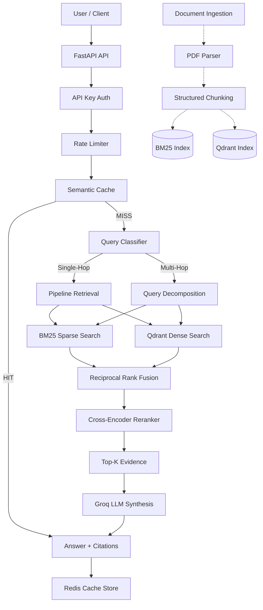

# HydraCache


An enterprise-grade hybrid RAG platform with semantic caching, multi-document retrieval, cross-encoder reranking, and production API infrastructure.

---

## Overview

HydraCache is a production-ready Retrieval-Augmented Generation (RAG) backend designed for complex enterprise document intelligence. While standard RAG implementations often struggle with structured data, exact-match queries, and cross-document dependencies, HydraCache introduces a sophisticated pipeline to overcome these limitations.

Currently, **SEC 10-K financial filings** (e.g., Apple 2023, 2024) are used as the demonstration corpus. However, the ingestion and retrieval architecture is entirely generalized and supports parsing, chunking, and reasoning over any dense enterprise documents, policies, or manuals.

---

## Problem Statement

Standard "chat with PDF" projects frequently fail in enterprise environments due to several structural weaknesses:

1. **Poor Exact Matching**: Pure dense vector retrieval struggles with exact product codes, ticket numbers, and specific financial figures.
2. **Context Destruction**: Naive text chunking destroys table structures, lists, and surrounding narrative context.
3. **Redundant LLM Costs**: Identical or semantically similar queries repeatedly invoke expensive, high-latency LLM generations.
4. **Isolated Retrieval**: Multi-document questions require pulling discrete pieces of evidence from different sources and reconciling them.
5. **Lack of Infrastructure**: Most proof-of-concept RAG systems lack authentication, rate limiting, logging, and asynchronous job management required for production.

---

## Solution

HydraCache directly addresses these enterprise bottlenecks through a tiered architecture:

| Problem | HydraCache Solution |
|---|---|
| **Exact matching** | Sparse BM25 indexing and retrieval |
| **Semantic understanding** | Dense embedding retrieval (FastEmbed / BGE) |
| **Combined retrieval** | Reciprocal Rank Fusion (RRF) |
| **Precision** | Cross-Encoder reranking |
| **Repeated queries** | Redis Semantic Cache (bypasses retrieval & generation) |
| **Context preservation** | Structured block ingestion + document-aware metadata |
| **Multi-document questions** | Query decomposition + independent multi-hop retrieval |
| **Production access** | FastAPI + API-key authentication + Token-bucket rate limiting |
| **Observability** | Structured logging + Request IDs |

---

## Key Features

- **Hybrid Retrieval**: Parallel BM25 + Dense vector execution for maximum recall.
- **Cross-Encoder Reranking**: Fine-grained relevance scoring of the fused candidate pool.
- **Redis Semantic Cache**: Sub-10ms response times for semantically similar questions.
- **Table-Aware Ingestion**: Preserves structural integrity of financial tables during chunking.
- **Query Decomposition**: LLM-based query classification dynamically routes complex questions into a multi-hop pipeline.
- **Cross-Document Conflict Detection**: Synthesizer prompts explicitly designed to articulate discrepancies (e.g., restated financials) rather than silently merging them.
- **FastAPI Production Service**: Fully asynchronous service layer.
- **API-Key Auth & Rate Limiting**: Per-client SHA-256 hashed tracking with 10 req/min limits.
- **Evaluation Dashboard**: Built-in Streamlit UI for query visualization and caching telemetry.

---

## Architecture

HydraCache processes incoming queries through a branching pipeline that prioritizes latency optimization (via cache) and accuracy (via decomposition and reranking).



### Retrieval Pipeline Deep-Dive

1. **Query**: The user submits a question.
2. **Decomposition**: If classified as multi-hop, it is broken into sub-questions.
3. **Retrieval**: Both BM25 and Dense Qdrant execute concurrently (retrieving Top-20 candidates each).
4. **Fusion**: Results are merged using Reciprocal Rank Fusion (RRF).
5. **Reranking**: A powerful MS-MARCO Cross-Encoder re-scores the fused pool against the *original query* to select the definitive Top-5 candidates.
6. **Synthesis**: A grounded LLM generation constructs the final answer with explicit `document_id` citations.

---

## Semantic Cache

To minimize LLM costs and latency, queries are embedded and searched against a Redis vector space. If the cosine distance between the incoming query and a historical query is below the strict similarity threshold, the system returns the cached answer and context instantly, entirely bypassing the retrieval and generation stages.

- **Threshold Tuning**: The cache operates with a strict, tunable cosine distance threshold.
- **Fail-Open Design**: If the Redis connection fails, the system safely falls back to standard LLM retrieval.

---

## Multi-Document / Multi-Hop Reasoning

HydraCache is fundamentally a multi-document system. For example, if asked:
*"What was the reported net sales for 2023, and are there discrepancies between the 2023 and 2024 reports?"*

The system will:
1. **Detect** multi-hop requirements.
2. **Decompose** the query into two independent targeted searches.
3. **Retrieve & Merge** evidence from both the 2023 and 2024 documents.
4. **Rerank** the combined pool to find the conflicting figures.
5. **Synthesize** a transparent answer that explicitly highlights the restatement of the financial metric.

---

## Methods & Techniques Used

| Method | Purpose |
|---|---|
| BM25 | Exact/keyword retrieval |
| Dense Embeddings | Semantic retrieval |
| RRF | Rank fusion |
| Cross-Encoder | Fine-grained relevance scoring |
| Redis Vector Search | Semantic caching |
| Parent/Child context | Context preservation |
| Qdrant | Dense vector storage |
| FastAPI | Service layer |
| API-key auth | API protection |
| slowapi | Rate limiting |
| Ragas | RAG evaluation framework |
| Streamlit | Evaluation/demo interface |
| Groq | LLM synthesis/evaluation |
| Query decomposition | Multi-hop retrieval |

---

## Implementation Phases

- ✅ **Phase 0 — Foundation**: Repository scaffolding and Docker infrastructure (Qdrant & Redis).
- ✅ **Phase 1 — Parsing, Chunking & Indexing**: Structured ingestion of SEC filings preserving tables and paragraphs.
- ✅ **Phase 2 — Hybrid Retrieval**: BM25 + Dense embeddings + RRF + Cross-Encoder reranking.
- ✅ **Phase 3 — Semantic Cache**: Redis vector-backed caching and grounded LLM generation.
- ✅ **Phase 4 — Evaluation**: Ground-truth benchmarking suite and Streamlit observability dashboard.
- ✅ **Phase 5 — Production API**: FastAPI service, API-key authentication, slowapi rate limiting, and async ingestion jobs.
- ✅ **Phase 6 — Multi-Document**: Cross-document conflict detection and LLM query decomposition.

---

## Tech Stack

| Layer | Technologies |
|---|---|
| **Runtime & API** | Python 3.10+, FastAPI, Uvicorn, slowapi |
| **Vector Store** | Qdrant (Docker) |
| **Cache & State** | Redis (Docker) |
| **Sparse Retrieval** | Rank-BM25 |
| **Embeddings** | FastEmbed (BAAI/bge-small-en-v1.5) |
| **Reranking** | Cross-Encoder (MS-MARCO MiniLM) |
| **LLM Inference** | Groq API (`openai/gpt-oss-20b`) |
| **Evaluation** | Ragas framework |
| **UI** | Streamlit |

---

## Project Structure

```text
HydraCache/
├── src/
│   ├── ingestion/    # PDF parsing and table-aware chunking
│   ├── indexing/     # Qdrant and BM25 index management
│   ├── retrieval/    # Hybrid RRF, Cross-Encoder, and pipeline orchestration
│   ├── cache/        # Redis semantic vector cache
│   ├── generation/   # Groq LLM synthesis and query decomposition
│   └── api/          # FastAPI routes, auth, and rate limiting
├── eval/             # Benchmark datasets, profiling scripts, and results
├── scripts/          # Ingestion runners and verification scripts
├── tests/            # Full pytest regression suite
├── data/             # Raw PDFs and serialized sparse indexes
├── app.py            # Streamlit observability dashboard
├── docker-compose.yml
├── requirements.txt
├── .env.example
├── README.md
├── decisions.md
└── flow.md
```

---

## Setup

### 1. Clone & Environment
```bash
git clone https://github.com/yourusername/HydraCache.git
cd HydraCache

# Create and activate virtual environment
python -m venv .venv
.\.venv\Scripts\activate   # Windows
# source .venv/bin/activate  # Linux/Mac

# Install dependencies
pip install -r requirements.txt
```

### 2. Configure Environment Variables
Create a `.env` file (see `.env.example`):
```env
# Infrastructure
QDRANT_HOST=localhost
QDRANT_PORT=6333
REDIS_URL=redis://localhost:6379/0

# API Security
API_KEY=your_secure_api_key_here
RATE_LIMIT_PER_MINUTE=10

# External APIs
GROQ_API_KEY=your_groq_api_key_here
```

### 3. Start Infrastructure
```bash
docker compose up -d
```

### 4. Build Indexes
```bash
python scripts/run_indexing.py
```

### 5. Start API & Dashboard
**API:**
```bash
uvicorn src.api.main:app --port 8000
```
Visit http://127.0.0.1:8000/docs for Swagger UI.

**Dashboard:**
```bash
streamlit run app.py
```
Visit http://localhost:8501 for evaluation metrics and traces.

---

## API Usage

**Query Endpoint:**
```bash
curl -X 'POST' \
  'http://127.0.0.1:8000/query' \
  -H 'accept: application/json' \
  -H 'X-API-Key: your_secure_api_key_here' \
  -H 'Content-Type: application/json' \
  -d '{
  "query": "What are the primary risk factors mentioned regarding supply chain disruptions?"
}'
```

---

## Evaluation & Profiling

HydraCache ships with a full evaluation suite.

- **Cache Performance**: During local cache profiling workloads, successful semantic cache hits effectively bypass remote generation and retrieval latency.
- **Ragas Evaluator Limitation**: The Ragas quality evaluator (measuring Faithfulness, Answer Relevance, and Context Precision) was fully implemented. However, generation of the final Ragas quality metrics for the benchmark test set was blocked by strict Groq API rate limits (`rate_limit_exceeded`) during execution. The metrics framework exists, but final numbers are not reported to prevent fabrication.

---

## Limitations & Future Improvements

- **Ragas Evaluation Limit**: Restricted by evaluator API quotas.
- **In-Memory Job Registry**: The `/documents` asynchronous ingestion endpoint utilizes an in-memory dictionary for job state tracking. For distributed production deployments, this should be migrated to Celery/Redis.
- **Sequential Multi-Hop Retrieval**: Currently, sub-questions are retrieved sequentially. Future updates should execute sub-question retrieval asynchronously to reduce latency.
