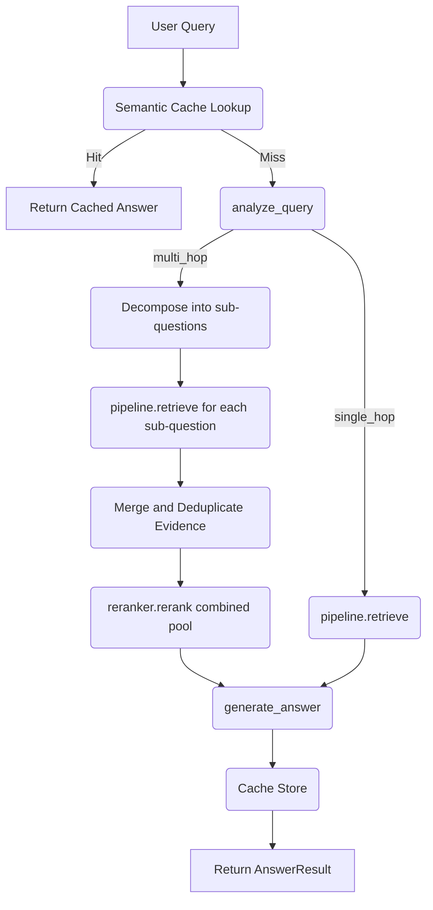

# HydraCache Execution Flow

This file documents how the code actually executes and interacts.

## Phase 0

### Entry Point
- `scripts/verify_infra.py`
- `tests/test_infra.py`

### Execution Flow
1. **Verification Script**: User runs `python scripts/verify_infra.py`.
2. Script verifies current Python version.
3. Script attempts a connection to Qdrant (HTTP) on `localhost:6333`.
4. Script attempts a connection to Redis (TCP) on `localhost:6379`.
5. Script outputs success or failure for each check.

### Function Call Chain
```text
scripts/verify_infra.py
 -> check_python_version()
 -> check_qdrant()
 -> check_redis()
```

### Data Flow
N/A (No data ingestion yet)

### External Dependencies
- Qdrant (Docker: `qdrant/qdrant:latest`)
- Redis Stack (Docker: `redis/redis-stack:latest`)

### Files Changed
- `scripts/verify_infra.py`
- `tests/test_infra.py`
- `docker-compose.yml`
- configuration boilerplate (`.env`, `requirements.txt`, etc.)

### Phase Changes
- Created foundational directory structure.
- Created `docker-compose.yml` for Qdrant and Redis.
- Created `verify_infra.py` script.
- Created basic tests for infrastructure.

## Phase 1 (Indexing Pipeline)

### Entry Point
- `scripts/run_indexing.py`

### Execution Flow
1. **Parser**: Iterates over PDF pages using `pdfplumber`. Extracts tables and converts them to markdown. Extracts remaining text. Emits logical `Document` objects with `chunk_type` metadata.
2. **Chunker**: 
    - Tables: Yielded directly as Parent=Child chunks.
    - Text: Split into sentences, then grouped into sliding windows (size 3, overlap 1) to create Child chunks. Parent text is retained in metadata.
3. **Dense Indexing**: FastEmbed `bge-small-en-v1.5` embeds the Child chunks. They are upserted into Qdrant (`apple_10k` collection), with payload preserving `parent_id` and `chunk_type`.
4. **Sparse Indexing**: Tokenizes Child chunks and builds a `BM25Okapi` index, saving it to disk (`data/processed/bm25_index.pkl`).

### Function Call Chain
```text
scripts/run_indexing.py
 -> PDFParser.parse()
 -> TextChunker.chunk_documents()
 -> DenseIndexer.index()
 -> SparseIndexer.index()
```

## Phase 2 (Retrieval Pipeline)

### Milestone 2: Dense Retrieval
1. **DenseRetriever**: `src.retrieval.dense.DenseRetriever.retrieve()` is called with a query and `top_k`.
2. Uses `QdrantClient` configured with the Phase 1 embedding model (`BAAI/bge-small-en-v1.5`).
3. Executes `client.query()` to automatically embed the query text and perform a vector search in Qdrant.
4. Converts Qdrant response payload into `RetrievalResult` objects preserving chunk_id, document text, score, and parent_id.

### Milestone 3: Hybrid Retrieval & Fusion
1. **HybridRetriever**: `src.retrieval.hybrid.HybridRetriever.retrieve_hybrid()` is called.
2. It launches `sparse.retrieve()` and `dense.retrieve()` concurrently using a `ThreadPoolExecutor`.
3. Both lists of `RetrievalResult` objects are collected and fed into fusion.
4. **Fusion**: `src.retrieval.fusion.rrf_fuse()` iterates over both lists.
    - Each `chunk_id`'s score is accumulated as `Σ 1 / (60 + rank_i)`.
    - Tracks provenance (which retriever yielded the chunk).
5. The merged dictionary is sorted by RRF score descending.
6. Returns the Top-20 candidate pool.

### Milestone 4: Cross-Encoder Reranking
1. The Top-20 candidates from `HybridRetriever` are passed to `Reranker.rerank()`.
2. The `TextCrossEncoder(BAAI/bge-reranker-base)` model generates pairwise relevance scores.
3. Rerank scores are assigned to the candidates.
4. Candidates are sorted descending by `rerank_score`.
5. The pipeline truncates and returns the Top-5 results.

### Function Call Chain
```text
scripts/test_pipeline.py
 -> PipelineRetriever.retrieve()
   ├── HybridRetriever.retrieve_hybrid()
   │    ├── SparseRetriever.retrieve() [Thread 1]
   │    ├── DenseRetriever.retrieve() [Thread 2]
   │    └── rrf_fuse() -> Top-20
   └── Reranker.rerank() -> Top-5
```

### Phase 3: Semantic Caching
1. User submits a query via `AnswerPipeline.answer()`.
2. `SemanticCache.lookup()` embeds the query (`bge-small-en-v1.5`) and queries the Redis vector index.
3. If the nearest cached query has a Cosine distance `< 0.15`, the cache yields a HIT and returns the cached answer instantly.
4. If MISS, the query falls through to `PipelineRetriever.retrieve()` (Phase 2 flow).
5. `generate_answer()` uses Groq (`openai/gpt-oss-20b`) to synthesize an answer grounded strictly in the Top-5 retrieved chunks.
6. The answer is cached via `SemanticCache.store()` with a 24-hour TTL (only if generation succeeds).

### Function Call Chain
```text
scripts/test_cache.py
 -> AnswerPipeline.answer(query)
   ├── SemanticCache.lookup(query)
   │     └── [If Hit -> Return]
   │     └── [If Miss -> Continue]
   ├── PipelineRetriever.retrieve(query)
   │    ├── HybridRetriever.retrieve_hybrid()
   │    │    ├── SparseRetriever [Thread 1]
   │    │    ├── DenseRetriever [Thread 2]
   │    │    └── rrf_fuse() -> Top-20
   │    └── Reranker.rerank() -> Top-5
   ├── generate_answer(query, Top-5 context)
   └── SemanticCache.store(query, generated_answer)
```

## Phase 4 (Evaluation with Incremental Saves)
1. `eval/run_eval.py` loads the 20-question `test_set.json`.
2. Script checks `eval/results.json` to identify previously evaluated IDs and skip them.
3. For each missing question, it invokes the target system (Baseline or Optimized) to get the answer and context.
4. A 1-item HuggingFace `Dataset` is built.
5. `ragas.evaluate` is called with `RunConfig(max_workers=1)` and `raise_exceptions=False`.
6. The result is serialized and incrementally saved to `eval/results.json`.

## Phase 5 (Production Hardening)

### /query
```text
HTTP POST /query
 -> add_request_id_and_log (Middleware)
 -> get_api_key (Auth Dependency)
 -> get_client_id (Rate Limit Identity)
 -> limiter.limit (Rate Limit)
 -> query_endpoint
   -> request payload validation (Pydantic QueryRequest)
   -> app.state.pipeline.answer(query)
     -> [SemanticCache]
     -> [Phase 2 Retrieval on Miss]
     -> [Generation on Miss]
   -> response formatting (Pydantic QueryResponse)
```

### /documents
```text
HTTP POST /documents (Multipart Form PDF)
 -> add_request_id_and_log (Middleware)
 -> get_api_key (Auth Dependency)
 -> limiter.limit (Rate Limit)
 -> upload_document
   -> validate PDF content-type and size
   -> save PDF to disk
   -> register job in memory (job_registry)
   -> enqueue run_ingestion_pipeline in BackgroundTasks
 -> respond with job_id (status: queued)

Background Task: run_ingestion_pipeline
 -> update job status to 'running'
 -> PDFParser.parse()
 -> TextChunker.chunk_documents()
 -> DenseIndexer.index()
 -> SparseIndexer.index()
 -> update job status to 'completed' or 'failed'
```

### /documents/{job_id}
```text
HTTP GET /documents/{job_id}
 -> add_request_id_and_log (Middleware)
 -> get_api_key (Auth Dependency)
 -> limiter.limit (Rate Limit)
 -> get_job_status
   -> lookup in memory job_registry
   -> format response (Pydantic JobStatusResponse)
```

## Phase 6 Multi-Hop Execution Flow

